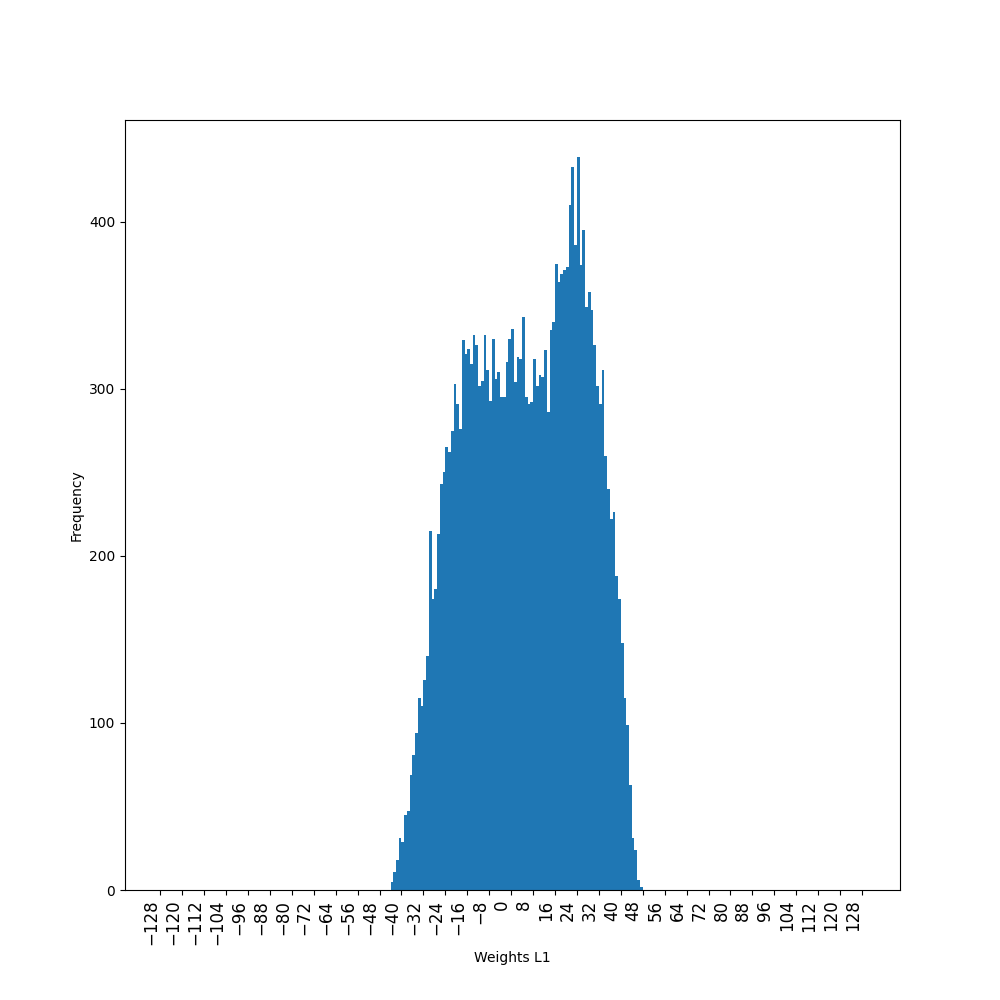

**SGRACE demo** 

**HARDWARE MODE**

To use the demo to test the hardware accelerator on the FPGA:

**1. Check lines in notebook demo_sgrace.ipynb**

import sys

sys.path.insert(1, '/home/xilinx/jupyter_notebooks/sgrace_lib')

This lines indicate where the sgrace hardware library files are stored. 

This library takes of all the interfacing and control of the hardware accelerator. 

Therefore only minimum modifications are needed in the model itself to make use of the accelerator. 

Create a directory like '/home/xilinx/jupyter_notebooks/sgrace_lib' and save sgrace.py (from directory sgrace_lib) and config.py (from your board directory) in it.

**2. sgrace.py loads a FPGA bit file called gat_all_unsigned.bit.**

Make sure you move the provided  bit and hwh files to the overlays directory with the correct name.

**3. If the notebook is set to training=0 only inference will be run. Set training to 1 to perform training as well.**

    If the notebook is set to load model parameters from a file such as "models/model_photo_8bit.ptx". 

    Make sure you store the provided model to the "models" directory.

**4. The notebook uses neighborLoader to load subgraphs and perform inference on them. Accuracy is around 90% with this data set and configuration.**

In demo_sgrace there is a setting full_graph that when set to 1 uses standard loader to process the whole graph together while setting at 0 uses neighborloader.
Different datasets are possible from planetoid for full_graph 1 and Amazon for full_graph 0. 

**5. The hardware library makes it easy to use the hardware since the only key steps are:**

 5.1

 Import the hardware layers:

 import config

 from sgrace import init_SGRACE,GATConv_SGRACE, Relu_SGRACE

 config.py contains important hardware settings like using attention (i.e GAT) or not (i.e. GCN). The quantization target for hardware-aware training (i.e 8-bit down to 1-bit) etc.
 sgrace.py contains important setting for tensor thresholds and internal scaling for each quantization target. You can examine those searching sgrace.py for **w_qbits == x** where x is your   quantization target (e.g. 8) 

 In config.py to use the hardware accelerator the variable **acc** needs to be set to one and **device** needs to be set to cpu (This is the ARM cpu available on the FPGA board). The ARM cpu will run the model and offload layer processing to the FPGA accelerator automatically. 
  
 
5.2

 Use in the notebook init_sgrace to initialize the hardware that will load the bit file and set some registers.

5.3

 replace software layers with hardware layers like:

 self.att1 = GATConv(dataset.num_node_features, hidden_channels)

 with

 self.att2 = GATConv_SGRACE(dataset.num_node_features, hidden_channels,head_count,dropout=0.1, alpha=0.2, concat=False)

**EMULATION MODE**

To use the demo to emulate the hardware accelerator and explore quantization targets. The steps below have been already prepared in the demo_sgrace.py located in the emulation directory 

**6. In this scenario the FPGA hardware bit files are not used but the quantization/dequantization hardware stages are emulated in software.**

This is useful to explore possible quantization strategies and targets on a desktop computer or to generate pretrained models that can then be used by hardware. Make sure that **fake_quantization** is set to 1 in config.py so the quantization processes are emulated in software. If **fake_quantization** is set to 0 then floating-point precision is used.

**7. Check lines in notebook demo_sgrace.ipynb**

import sys

sys.path.insert(1, '/media/josnu02/hd1/josnu02/cuda_performance/sgrace_lib'))

This lines indicate where the sgrace hardware library files are stored. 

This library takes of all the interfacing and control of the hardware accelerator. 

Therefore only minimum modifications are needed in the model itself to make use of the accelerator. 

Create a directory like to your preferred location in your system and modify '/media/josnu02/hd1/josnu02/cuda_performance/sgrace_lib' accordingly. Save sgrace.py (from directory sgrace_lib) and config.py (from directory emulation) in it.

We will use the python script located in the emulation directory to test the emulation mode. 

**8. Check the value of **device** in config.py and select emulation target as either cpu or cuda:0. (0 identifies your GPU number)**

**9. MAKE SURE that **acc** is set to 0 in config.py since we are not going to use the hardware accelerator.**

**10. The hardware library makes it easy to use the emulation since the only key steps are:**

10.1

 Import the hardware layers:

 import config

 from sgrace import init_SGRACE,GATConv_SGRACE, Relu_SGRACE

 config.py contains important hardware settings like using attention (i.e GAT) or not (i.e. GCN). The quantization target for hardware-aware training (i.e 8-bit down to 1-bit) etc.
 sgrace.py contains important setting for tensor thresholds and internal scaling for each quantization target. You can examine those searching sgrace.py for **w_qbits == x** where x is  your   quantization target (e.g. 8). 

10.2

 Use init_sgrace to initialize the emulation mode.

10.3

 replace pytorch software layers with hardware layers like:

 self.att1 = GATConv(dataset.num_node_features, hidden_channels)

with

 self.att2 = GATConv_SGRACE(dataset.num_node_features, hidden_channels,head_count,dropout=0.1, alpha=0.2, concat=False)

10.4 The previous steps very similar as in 5 but now instead of offloading to the FPGA all the layer processing happens on the CPU or GPU including the quantization/dequantization functions. 

The key variables are **acc** in config.py the is now set to zero and **fake_quantization** set to one so all hardware processing is emulated in software. 

**11. All these preparation steps for emulation have already been done in the demo_sgrace.py located in the emulation directory.** 

Run the emulation mode demonstration in your desktop with python3 demo_sgrace.py. Remember we are not use the FPGA board at all in emulation mode and just using your main desktop to run the model. The desktop emulation can use a CUDA GPU (if available) changing the device setting in config.py but this is not necessary.   

The model runs and starts training for 100 epochs. The best accuracy achieved is around 0.86 on the cora dataset with 8-bits. The script also tries to display some plots on weight distribution but if the plotting part is not working then this part can be disable.  

 

